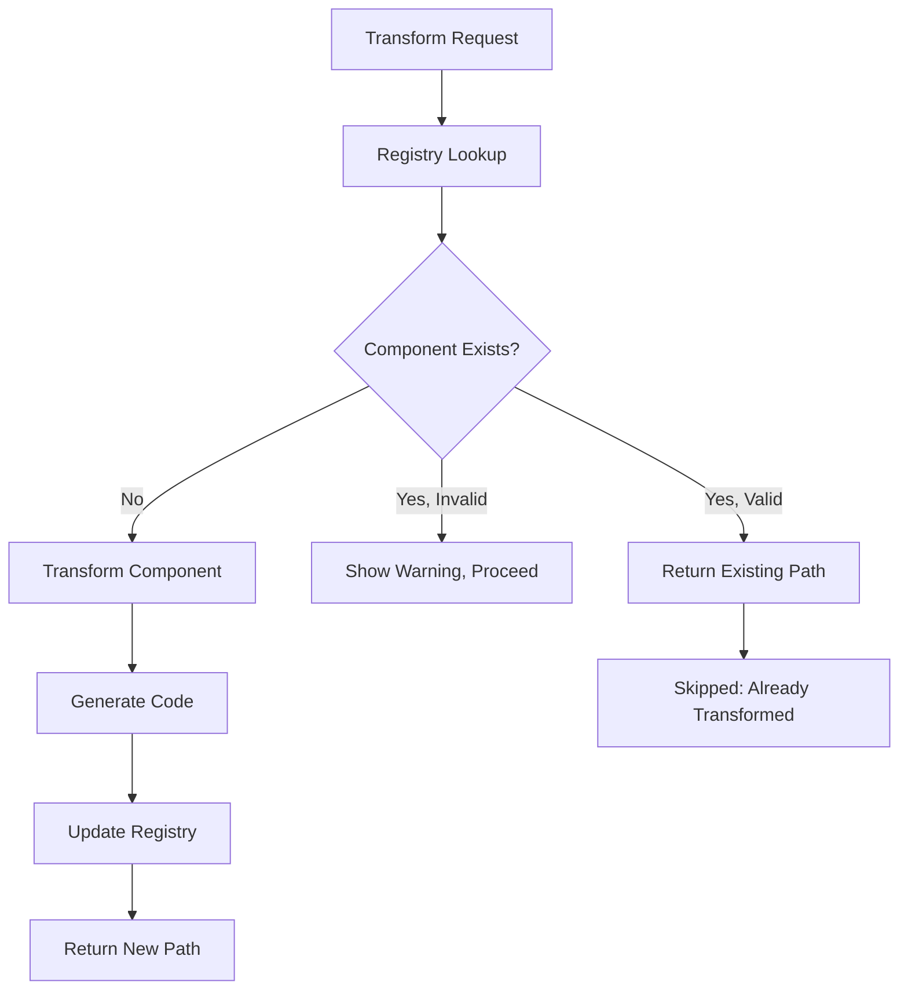
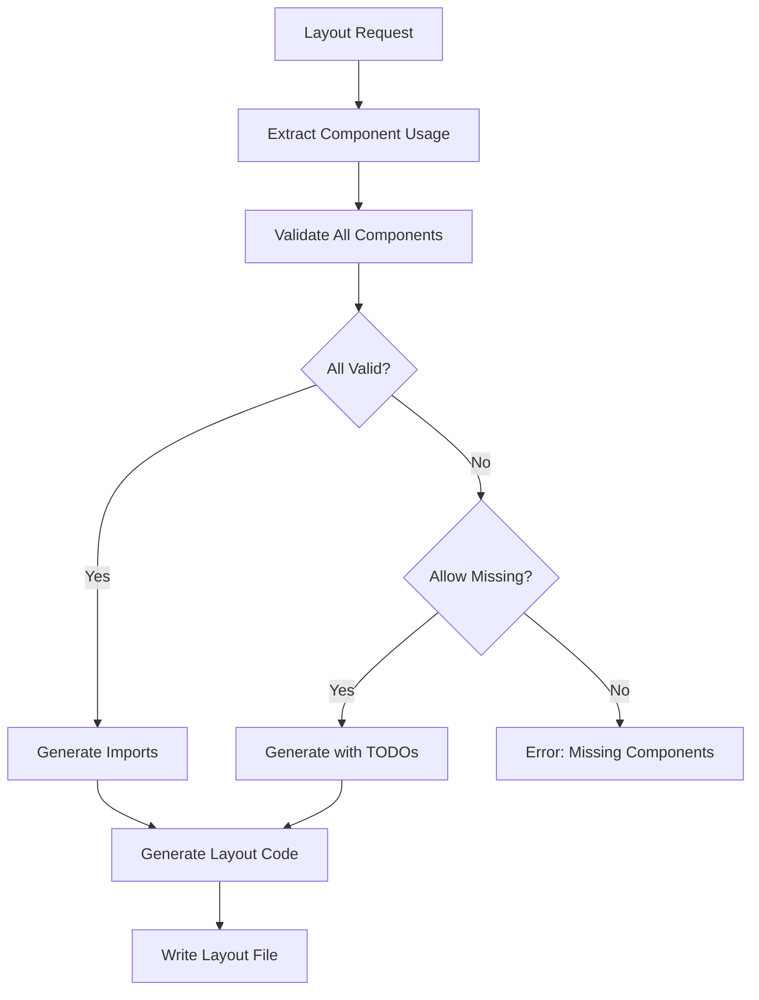

# Component Registry Integration

**Universal Component Reuse System for All Design Transform Skills**

## Overview

The component registry integration ensures that components are **never duplicated** across transformations and layouts. All design-transform skills (React, Vue, Angular, Flutter, etc.) now automatically check the registry before transforming, preventing wasted effort and ensuring consistency.

## Key Benefits

✅ **Zero Duplication** - Components are transformed once and reused everywhere
✅ **Automatic Detection** - Registry lookup happens automatically in all transform skills
✅ **Framework Universal** - Works across React, Vue, Angular, Flutter, React Native, etc.
✅ **Layout Composition** - Layouts use actual registry components, not recreations
✅ **Smart Validation** - Identifies missing, invalid, or incomplete transformations
✅ **Developer Friendly** - Clear error messages with actionable suggestions

---

## Architecture

### Core Components

```
ComponentRegistryManager
├── Registry Lookup (findComponent, validateComponent)
├── Import Generation (getImportStatement, getImportStatements)
├── Path Resolution (getComponentPath, getStoryPath)
└── Statistics (getStatistics, getMissingComponents)

EnhancedComponentTransformer (Base Class)
├── Pre-Transform Registry Check ✨ NEW
├── Component Extraction
├── Code Generation
└── Registry Update

LayoutGenerator (Base Class)
├── Component Usage Extraction
├── Registry Validation ✨ NEW
├── Import Statement Generation ✨ NEW
└── Framework-Specific Code Generation
```

### Integration Points

All transform skills inherit from `EnhancedComponentTransformer`:
- `ReactComponentTransformer` (Next.js/React)
- `VueComponentTransformer` (Vue 3)
- `AngularComponentTransformer` (Angular)
- `FlutterComponentTransformer` (Flutter/Dart)
- `ReactNativeComponentTransformer` (React Native)
- etc.

---

## How It Works

### 1. Component Transformation Flow



### 2. Layout Generation Flow



---

## Usage Examples

### Example 1: Component Transformation (Automatic Registry Check)

```javascript
const ReactComponentTransformer = require('./react-component-transformer');

const transformer = new ReactComponentTransformer(projectPath);

// Automatic registry check happens here ✨
const result = await transformer.transformComponent('Button');

if (result.skipped) {
  console.log(`Component already exists: ${result.outputPath}`);
  // Output: Component already exists: src/design-system/components/Button.tsx
} else {
  console.log(`Component transformed: ${result.outputPath}`);
}
```

**Console Output:**
```
[nextjs] Transforming: Button
  ✓ Component already exists in registry
  → Using existing: src/design-system/components/Button.tsx
```

### Example 2: Layout Generation (Registry-Based Composition)

```javascript
const ReactLayoutGenerator = require('./react-layout-generator');

const generator = new ReactLayoutGenerator(projectPath);

// Generates layout using registry components ✨
const result = await generator.generateLayout('Examples-Pricing', {
  allowMissing: true,   // Show TODOs for missing components
  allowInvalid: true    // Show TODOs for invalid components
});

console.log(`Components used: ${result.componentsUsed}`);
console.log(`Components missing: ${result.componentsMissing}`);
```

**Generated Output:**
```typescript
import { Header } from '../src/design-system/components/Header';
import { HeroBasic } from '../src/design-system/components/Herobasic';
import { Footer } from '../src/design-system/components/Footer';

const ExamplesPricing: React.FC = () => {
  return (
    <PageContainer>
      <Header className="header" />
      <HeroBasic className="hero-basic" />
      {/* TODO: Component "Accordion" not found in registry */}
      <Footer className="footer" />
    </PageContainer>
  );
};
```

### Example 3: Validate Components Before Layout Generation

```javascript
const ComponentRegistryManager = require('./component-registry-manager');

const registry = new ComponentRegistryManager(projectPath);

// Check which components are missing
const requiredComponents = ['Header', 'Hero Basic', 'Footer', 'Accordion'];
const validation = registry.validateComponents(requiredComponents, 'nextjs');

console.log(`Valid: ${validation.valid.length}`);
console.log(`Missing: ${validation.missing.length}`);

// Transform missing components
for (const missing of validation.missing) {
  console.log(`Need to transform: ${missing.name}`);
  console.log(`Suggestion: ${missing.suggestion}`);
}
```

**Output:**
```
Valid: 3
Missing: 1
Need to transform: Accordion
Suggestion: Run /design-transform-nextjs to create it
```

---

## Component Registry Manager API

### Core Methods

#### `findComponent(componentName, framework)`
Searches registry for a component by name and optional framework.

```javascript
const component = registry.findComponent('Button', 'nextjs');
if (component) {
  console.log(`Found: ${component.transformation.codePath}`);
}
```

#### `validateComponent(componentName, framework)`
Comprehensive validation with actionable feedback.

```javascript
const validation = registry.validateComponent('Button', 'nextjs');

if (validation.valid) {
  console.log(`✓ Valid: ${validation.codePath}`);
} else {
  console.log(`✗ Invalid: ${validation.message}`);
  console.log(`Suggestion: ${validation.suggestion}`);
}
```

**Validation Response:**
```javascript
{
  valid: true,
  component: { /* full component entry */ },
  codePath: '/absolute/path/to/Button.tsx',
  storyPath: '/absolute/path/to/Button.stories.tsx',
  import: "import { Button } from '../design-system/components/Button';"
}
```

#### `getImportStatement(componentName, framework, fromPath)`
Generates correct import statement (relative or absolute).

```javascript
const importStmt = registry.getImportStatement('Button', 'nextjs', '/pages/index.tsx');
// Returns: "import { Button } from '../src/design-system/components/Button';"
```

#### `getMissingComponents(requiredComponents, framework)`
Returns list of components that need transformation.

```javascript
const missing = registry.getMissingComponents(['Button', 'Card', 'Header'], 'nextjs');
// Returns: ['Card'] (if Button and Header exist but Card doesn't)
```

#### `getStatistics(framework)`
Get registry coverage statistics.

```javascript
const stats = registry.getStatistics('nextjs');
console.log(`Total: ${stats.total}`);
console.log(`Transformed: ${stats.transformed}`);
console.log(`Pending: ${stats.pending}`);
```

---

## Enhanced Component Transformer Integration

### Automatic Registry Check (Built-in)

All framework transformers now include automatic registry checks:

```javascript
class EnhancedComponentTransformer {
  async transformComponent(componentName, options = {}) {
    // ✨ NEW: Registry check happens automatically
    const validation = this.registryManager.validateComponent(componentName, this.framework);

    if (validation.valid) {
      console.log(`✓ Component already exists in registry`);
      return {
        success: true,
        componentName,
        outputPath: validation.codePath,
        skipped: true,
        reason: 'already-transformed'
      };
    }

    // Continue with transformation if not found or invalid
    // ...
  }
}
```

### Force Re-transformation

To force re-transformation of an existing component:

```javascript
const result = await transformer.transformComponent('Button', {
  forceRetransform: true  // Skip registry check
});
```

---

## Layout Generator Integration

### Component Usage Extraction

The layout generator automatically extracts component instances from Figma layouts:

```javascript
class LayoutGenerator {
  _extractComponentUsage(layoutJson) {
    // Traverses layout JSON to find all INSTANCE nodes
    // Returns array of component usage with:
    // - name, instanceName, id, mainComponentId
    // - variants, position, size
  }
}
```

### Registry Validation

Before generating layout code, all components are validated:

```javascript
const validation = this.registryManager.validateComponents(componentNames, framework);

// validation.valid    -> Components ready to use
// validation.missing  -> Components not in registry
// validation.invalid  -> Components with incomplete transformations
```

### Import Generation

Imports are generated from validated components:

```javascript
const imports = this.generateImports(validation.valid, outputPath);
// Returns array of import statements with correct relative paths
```

---

## Registry Schema

### Component Entry Structure

```json
{
  "figma-plugin-button-4185-3778": {
    "id": "figma-plugin-button-4185-3778",
    "name": "Button",
    "type": "COMPONENT_SET",
    "category": "atoms",
    "transformation": {
      "state": "code-generated",
      "framework": "nextjs",
      "transformedAt": "2026-01-08T17:00:00.000Z",
      "codePath": "src/design-system/components/Button.tsx",
      "storyPath": "src/stories/Button.stories.tsx",
      "fullContent": true,
      "dependencies": {
        "resolved": [],
        "missing": []
      }
    }
  }
}
```

### Transformation States

| State | Description | Valid for Use? |
|-------|-------------|----------------|
| `code-generated` | Component code written | ✅ Yes |
| `verified` | Code verified/tested | ✅ Yes |
| `production` | Production-ready | ✅ Yes |
| `pending` | Not yet transformed | ❌ No |
| `in-progress` | Transformation ongoing | ❌ No |
| `failed` | Transformation failed | ❌ No |

---

## Error Handling

### Missing Component

```
⚠️  Missing components from registry:
   - Accordion: Component "Accordion" not found in registry
     Run /design-transform-nextjs to create it
```

### Invalid Component

```
⚠️  Invalid components (transformation incomplete):
   - Header Auth: Component "Header Auth" is registered but code file is missing
     Re-run transformation for Header Auth
```

### File Not Found

```javascript
{
  valid: false,
  reason: 'file_missing',
  message: 'Component "Button" is registered but code file is missing',
  expectedPath: 'src/design-system/components/Button.tsx',
  suggestion: 'Re-run transformation for Button'
}
```

---

## Framework-Specific Implementations

### React/Next.js

```javascript
const ReactComponentTransformer = require('./react-component-transformer');
const ReactLayoutGenerator = require('./react-layout-generator');

// Transformation
const transformer = new ReactComponentTransformer(projectPath);
await transformer.transformComponent('Button');

// Layout generation
const generator = new ReactLayoutGenerator(projectPath);
await generator.generateLayout('Examples-Pricing');
```

### Vue 3

```javascript
const VueComponentTransformer = require('./vue-component-transformer');
const VueLayoutGenerator = require('./vue-layout-generator');

// Same API, different framework output
const transformer = new VueComponentTransformer(projectPath);
await transformer.transformComponent('Button'); // Generates .vue file
```

### Angular

```javascript
const AngularComponentTransformer = require('./angular-component-transformer');
const AngularLayoutGenerator = require('./angular-layout-generator');

// Same API, generates Angular components
const transformer = new AngularComponentTransformer(projectPath);
await transformer.transformComponent('Button'); // Generates .component.ts + .html + .css
```

---

## Best Practices

### 1. Always Use Registry Components

❌ **Wrong** - Recreating components:
```typescript
const Button = styled.button`
  padding: 8px 16px;
  background: #000;
`;
```

✅ **Right** - Using registry components:
```typescript
import { Button } from '../design-system/components/Button';

<Button>Click me</Button>
```

### 2. Check Registry Before Transforming

```javascript
// Check if component exists first
const validation = registry.validateComponent('Button', 'nextjs');

if (!validation.valid) {
  // Only transform if needed
  await transformer.transformComponent('Button');
}
```

### 3. Handle Missing Components Gracefully

```javascript
const result = await generator.generateLayout('MyLayout', {
  allowMissing: true  // Generate with TODOs instead of failing
});

// Transform missing components
for (const missing of result.validation.missing) {
  await transformer.transformComponent(missing.name);
}

// Re-generate layout with all components
await generator.generateLayout('MyLayout');
```

### 4. Use Bulk Validation

```javascript
const allComponents = ['Button', 'Card', 'Header', 'Footer'];
const validation = registry.validateComponents(allComponents, 'nextjs');

// Transform only missing components
for (const missing of validation.missing) {
  await transformer.transformComponent(missing.name);
}
```

---

## Testing

### Test Registry Lookup

```javascript
const ComponentRegistryManager = require('./component-registry-manager');

const registry = new ComponentRegistryManager('/path/to/project');

// Test component lookup
const component = registry.findComponent('Button', 'nextjs');
console.assert(component !== null, 'Button should exist');

// Test validation
const validation = registry.validateComponent('Button', 'nextjs');
console.assert(validation.valid === true, 'Button should be valid');

// Test import generation
const importStmt = registry.getImportStatement('Button', 'nextjs', '/pages/index.tsx');
console.assert(importStmt.includes('Button'), 'Import should include Button');
```

### Test Layout Generation

```javascript
const ReactLayoutGenerator = require('./react-layout-generator');

const generator = new ReactLayoutGenerator('/path/to/project');

const result = await generator.generateLayout('Examples-Pricing', {
  allowMissing: true
});

console.assert(result.success === true, 'Layout generation should succeed');
console.assert(result.componentsUsed > 0, 'Should use registry components');
```

---

## Troubleshooting

### Problem: Component not found in registry

**Cause**: Component hasn't been transformed yet

**Solution**: Run the appropriate transform skill
```bash
/design-transform-react  # For React/Next.js
/design-transform-vue    # For Vue
/design-transform-angular # For Angular
```

### Problem: Component registered but file missing

**Cause**: Component file was deleted after registration

**Solution**: Re-run transformation
```javascript
await transformer.transformComponent('Button', {
  forceRetransform: true
});
```

### Problem: Import paths incorrect

**Cause**: Component moved after transformation

**Solution**: Update registry entry or re-transform
```javascript
// Option 1: Re-transform
await transformer.transformComponent('Button', { forceRetransform: true });

// Option 2: Manually update registry codePath
```

---

## Migration Guide

### From Manual Component Creation

**Before** (Manual approach):
```typescript
// pages/pricing.tsx
const Header = styled.div`
  // manual styles
`;

const Hero = styled.div`
  // manual styles
`;

// Duplicated effort, inconsistent
```

**After** (Registry approach):
```typescript
// pages/pricing.tsx
import { Header } from '../src/design-system/components/Header';
import { Hero } from '../src/design-system/components/Hero';

// Reused components, consistent
```

### From Old Layout Generator

**Before** (Recreating components):
```javascript
// Generated hardcoded HTML/JSX
<div className="header">
  <div className="logo">Logo</div>
</div>
```

**After** (Using registry):
```javascript
// Uses actual transformed components
<Header className="header" />
```

---

## Summary

The component registry integration provides:

✅ **Automatic Duplication Prevention** - Built into all transform skills
✅ **Universal Framework Support** - Works across React, Vue, Angular, Flutter, etc.
✅ **Smart Layout Composition** - Layouts use actual registry components
✅ **Developer Productivity** - No manual checking, automatic validation
✅ **Clear Error Messages** - Actionable suggestions for missing components
✅ **Production Ready** - Consistent, reliable component reuse

**Result**: Components are transformed once and reused everywhere, eliminating duplication and ensuring consistency across your entire design system.

---

## Files

### Core Registry System
- `/opt/bumba-harness/.claude/shared-modules/design-system/component-registry-manager.js` (407 lines)
- `/opt/bumba-harness/.claude/shared-modules/design-system/enhanced-component-transformer.js` (Enhanced)
- `/opt/bumba-harness/.claude/shared-modules/design-system/layout-generator.js` (226 lines)

### Framework-Specific
- `/opt/bumba-harness/.claude/shared-modules/design-system/react-component-transformer.js` (Enhanced)
- `/opt/bumba-harness/.claude/shared-modules/design-system/react-layout-generator.js` (222 lines)

### Documentation
- `COMPONENT-REGISTRY-INTEGRATION.md` (This document)
- `STORYBOOK-INTEGRATION.md` (Automatic story generation)

---

*Last Updated: 2026-01-08*
*Version: 3.0.0*
