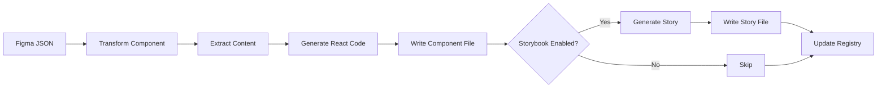

# Automatic Storybook Story Generation

## Overview

The design system transformation now **automatically generates Storybook stories** for every transformed component. This ensures that all components are:
- ✅ Documented
- ✅ Visually testable
- ✅ Interactive in Storybook
- ✅ Ready for design review

## How It Works

When you run `/design-transform-react` (or any React transformation skill), the system now:

1. **Transforms the component** from Figma JSON to React/TypeScript code
2. **Automatically generates a Storybook story** with:
   - Default story showing the component
   - Variant stories (if component has Figma variants)
   - Playground story with interactive controls
   - WithChildren story (if applicable)
   - Full TypeScript types and argTypes

## Files Created

For each component transformation, you'll get:

```
src/design-system/components/
  └── Button.tsx              # Component code

src/stories/
  └── Button.stories.tsx      # Auto-generated story ✨ NEW!
```

## Generated Story Structure

Each auto-generated story includes:

### 1. Meta Configuration
```typescript
const meta: Meta<typeof Button> = {
  title: 'Components/Button',
  component: Button,
  tags: ['autodocs'],
  argTypes: { /* Auto-generated controls */ },
};
```

### 2. Default Story
```typescript
export const Default: Story = {
  args: {
    // Extracted default props from Figma
  },
};
```

### 3. Variant Stories
```typescript
export const PrimaryLarge: Story = {
  args: {
    variant: 'primary',
    size: 'large',
  },
};
```

### 4. Playground Story
```typescript
export const Playground: Story = {
  args: {
    // All props available for interactive testing
  },
};
```

## Configuration Options

### Disable Storybook Generation

If you want to transform components **without** generating stories:

```javascript
const transformer = new ReactComponentTransformer(projectPath, {
  storybook: false  // Disable story generation
});
```

### Custom Storybook Category

Organize stories into custom categories:

```javascript
await transformer.transform(componentJson, {
  storybookCategory: 'Design System/Buttons'
});
```

## Viewing Stories in Storybook

1. **Start Storybook** (if not already running):
   ```bash
   npm run storybook
   ```

2. **Navigate to your component** in the sidebar:
   ```
   Components/
     └── Button/
         ├── Default
         ├── PrimaryLarge
         ├── SecondarySmall
         ├── Playground
         └── WithChildren
   ```

3. **Use the Controls panel** to:
   - Modify props interactively
   - Test different variants
   - Verify visual appearance
   - Export code snippets

## Benefits

### For Developers
- ✅ **Instant documentation** - No need to manually write stories
- ✅ **Interactive testing** - Try different props in Storybook
- ✅ **Type safety** - Full TypeScript integration
- ✅ **Code examples** - Auto-generated usage examples

### For Designers
- ✅ **Visual review** - See components in isolation
- ✅ **Variant comparison** - Compare all variants side-by-side
- ✅ **Design QA** - Verify implementation matches Figma
- ✅ **No code required** - Use Storybook UI to test components

### For Teams
- ✅ **Consistency** - All components documented the same way
- ✅ **Discoverability** - Easy to find and explore components
- ✅ **Collaboration** - Share component links with stakeholders
- ✅ **Regression testing** - Visual regression tests with Chromatic

## Story Generation Process



## Example: Auto-Generated Story

**Input**: Figma Button component with variants

**Output**: Complete Storybook story

```typescript
import type { Meta, StoryObj } from '@storybook/react';
import { Button } from '../design-system/components/Button';

/**
 * Button Component
 *
 * Button component from Figma design system.
 * Dimensions: 120×44px
 * 3 variants available.
 *
 * Generated from Figma Design System
 * Extraction Date: 2026-01-08
 */
const meta: Meta<typeof Button> = {
  title: 'Components/Button',
  component: Button,
  tags: ['autodocs'],
  argTypes: {
    className: {
      control: 'text',
      description: 'CSS class name',
    },
    variant: {
      control: 'text',
      description: 'Variant variant',
      defaultValue: 'primary',
    },
    size: {
      control: 'text',
      description: 'Size variant',
      defaultValue: 'medium',
    },
    children: {
      control: 'text',
      description: 'Child content',
    },
  },
};

export default meta;
type Story = StoryObj<typeof Button>;

/**
 * Default state of Button
 */
export const Default: Story = {
  args: {
    variant: 'primary',
    size: 'medium',
  },
};

/**
 * Button with variant=secondary
 */
export const VariantSecondary: Story = {
  args: {
    variant: 'secondary',
    size: 'medium',
  },
};

/**
 * Button with size=large
 */
export const SizeLarge: Story = {
  args: {
    variant: 'primary',
    size: 'large',
  },
};

/**
 * Button with custom children
 */
export const WithChildren: Story = {
  args: {
    children: 'Custom content goes here',
  },
};

/**
 * Interactive playground for Button
 * Use controls panel to modify props
 */
export const Playground: Story = {
  args: {
    variant: 'primary',
    size: 'medium',
  },
};
```

## Integration with Existing Workflows

### Design-Transform-React Skill

The `/design-transform-react` skill now **automatically** generates stories. No changes needed to your workflow!

```bash
/design-transform-react
# Component transformed ✓
# Storybook story generated ✓  <-- NEW!
```

### Batch Transformations

When transforming multiple components, stories are generated for **all** components:

```javascript
const components = ['Button', 'Card', 'Input'];
for (const component of components) {
  await transformer.transform(componentJson);
  // Component + Story both created automatically
}
```

### Registry Tracking

The component registry now tracks story paths:

```json
{
  "Button": {
    "path": "src/design-system/components/Button.tsx",
    "storyPath": "src/stories/Button.stories.tsx",  // NEW!
    "transformed": true,
    "dependencies": []
  }
}
```

## Troubleshooting

### Stories Not Generating?

Check that Storybook generation is enabled:
```javascript
transformer.generateStorybook // Should be true
```

### Story Errors in Storybook?

Common issues:
1. **Missing Storybook packages** - Run `npm install -D @storybook/react @storybook/addon-essentials`
2. **TypeScript errors** - Ensure `@storybook/react` types are installed
3. **Import paths** - Verify component import paths in story files

### Customize Generated Stories?

After generation, you can edit the `.stories.tsx` file manually. The next transformation will not overwrite your changes unless you delete the file first.

## Best Practices

1. **Review Generated Stories** - Always check the generated story in Storybook
2. **Add Custom Stories** - Add additional stories for edge cases
3. **Use Playground** - Use the Playground story for testing
4. **Document Behavior** - Add JSDoc comments to story descriptions
5. **Visual Regression** - Connect to Chromatic for visual testing

## Future Enhancements

Planned improvements:
- [ ] Smart prop controls (infer types from TypeScript)
- [ ] Accessibility stories (a11y testing)
- [ ] Responsive stories (viewport testing)
- [ ] Interaction stories (play functions)
- [ ] Auto-screenshot generation
- [ ] Figma link integration

## Summary

**Before**: Manually write Storybook stories for each component (time-consuming, inconsistent)

**After**: Stories automatically generated during transformation (fast, consistent, comprehensive)

This enhancement ensures that **every** transformed component is immediately documented, testable, and ready for design review in Storybook!
