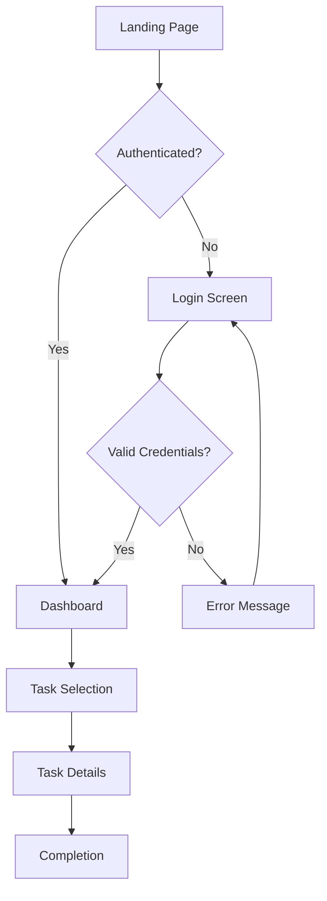
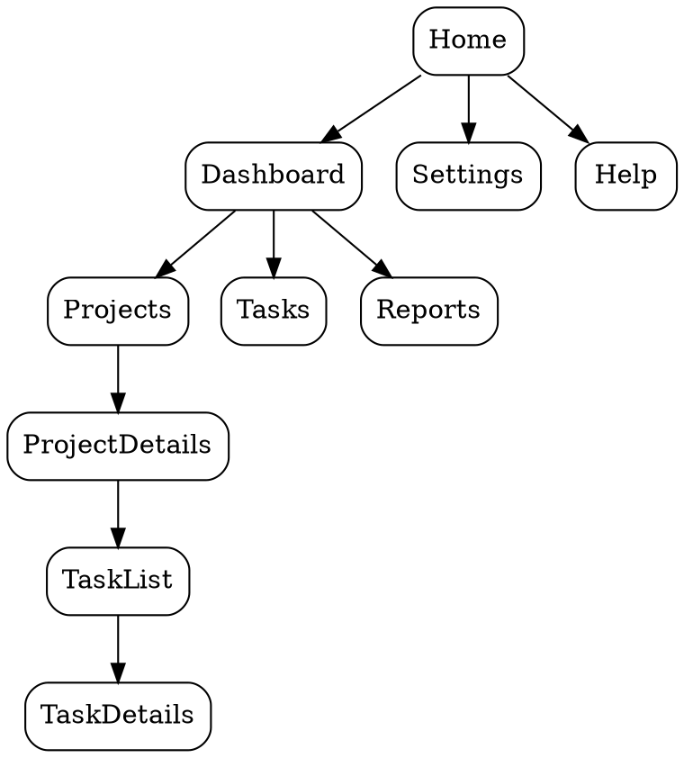

# ⚡ IMMEDIATE EXECUTION MODE

**WHEN THIS SKILL IS INVOKED**: Immediately jump to "Orchestration Workflow - EXECUTE IMMEDIATELY" section and start executing. DO NOT read the entire skill first. DO NOT wait for permission. DO NOT explain what you're going to do. Just START EXECUTING the workflow steps.

The user invoked this skill to RUN the exploration, not to learn about it.

---

# E2B Template Configuration

**MANDATORY**: This skill ONLY uses the `design-ux-template` E2B sandbox.

- Template ID: wg3bri8q5vqoxzbwvwik
- Contains: All UI tools PLUS graphviz, mermaid-cli, puppeteer, pa11y, axe-core, diagrams
- DO NOT use any other template

---

This skill guides creation of distinctive, production-grade frontend interfaces using the Bumba Design Bridge system. It combines user-centered design principles with deep awareness of your component registry, layout manifest, and design tokens to produce intuitive, cohesive experiences.

**UX DESIGN FOCUS**: This skill specializes in user experience and interaction aspects:
- User flows and journey mapping
- Information architecture and content organization
- Navigation patterns and wayfinding
- Interaction states and feedback mechanisms
- Accessibility validation (WCAG 2.1 AA)
- Mental models and cognitive load optimization

**4 UX DESIGN DIRECTIONS**:
This skill supports exploration across a conventional-to-experimental spectrum:
1. **Conventional**: Proven patterns, familiar mental models, zero learning curve, standard navigation
2. **Refined**: Enhanced conventions, streamlined flows, minimal learning, smart defaults
3. **Progressive**: Modern patterns, adaptive interfaces, progressive disclosure, moderate learning curve
4. **Experimental**: Novel paradigms, innovative mental models, adaptive learning interfaces, high impact

**UX TOOLS AVAILABLE IN SANDBOX**:
- **mermaid-cli**: Generate flow diagrams, user journeys, state diagrams
- **graphviz**: Create complex information architecture visualizations
- **puppeteer**: Automate interaction testing and screenshots
- **pa11y**: Automated accessibility testing (WCAG compliance)
- **axe-core**: In-depth accessibility audit and recommendations

**WHEN TO USE THIS SKILL**: Activate this skill whenever you detect:
- Work involving the `.design/` directory structure with UX focus
- References to Design Bridge, Bumba, with user flow or navigation emphasis
- Requests to design user flows, journeys, or interaction patterns
- Need for information architecture planning
- UX exploration requests across the 4-direction spectrum
- Accessibility testing or WCAG compliance validation
- Questions about navigation patterns or interaction states

The user provides UX requirements: a user flow, interaction pattern, navigation system, or information architecture challenge. They may include context about users, goals, or usability constraints.

---

## Part 1: Design Bridge System Awareness

Before designing, understand what's available to work with across three registries: **components**, **tokens**, and **layouts**.

### Directory Structure

Design Bridge maintains a comprehensive structure:

```
.design/
├── config.json               # Project configuration (framework, settings)
├── componentRegistry.json    # Master registry of all components
├── layoutManifest.json       # Registry of all extracted layouts
├── tokens/                   # Design tokens
│   ├── colors.json          # Color palette and semantic colors
│   ├── typography.json      # Font families, sizes, weights
│   └── spacing.json         # Spacing scale
├── components/               # Raw component data from extraction
├── layouts/                  # Extracted layout compositions
│   └── [layout-name]/
│       ├── layout.json      # Layout structure (flex, grid, spacing)
│       └── screenshot.png   # Visual reference from Figma
├── extracted-code/           # Transformed framework code
│   └── react/               # (or vue, angular, svelte, etc.)
│       ├── Button.tsx
│       ├── Card.tsx
│       └── layouts/
│           └── LoginScreen.tsx
└── stories/                  # Generated Storybook stories
```

### Component Registry

Read `.design/componentRegistry.json` to discover available components:

```json
{
  "components": [
    {
      "id": "figma-btn-123",
      "name": "PrimaryButton",
      "source": { "type": "figma" },
      "state": "TRANSFORMED",
      "transformedTo": ["react"],
      "outputPaths": {
        "react": ".design/extracted-code/react/PrimaryButton.tsx"
      },
      "variants": ["primary", "secondary", "ghost"]
    }
  ]
}
```

### Using Registry Assets for UX Design

When designing user experiences:

1. **Check component registry first** - Understand what interaction patterns are already available
2. **Map components to user actions** - Which components support which user tasks?
3. **Reference layouts for flow steps** - Use layout JSON as blueprints for journey stages
4. **Apply design tokens consistently** - Ensure cohesive experience across flows
5. **Verify interaction states** - Check that components support all needed states (loading, error, success)
6. **Plan for accessibility** - Ensure components have proper ARIA labels and keyboard navigation

---

## Part 2: UX Design Thinking

Before coding, understand the user context and commit to a clear interaction paradigm:

- **User Goals**: What are users trying to accomplish? What tasks must they complete?
- **Mental Model**: How do users conceptualize this system? What metaphors make sense?
- **Flow Type**: Linear wizard, hub-and-spoke dashboard, freeform exploration, guided tutorial?
- **Interaction Paradigm**: Direct manipulation, conversational, gesture-based, voice-driven?
- **Constraints**: Technical limitations, accessibility requirements, user capabilities
- **Direction Alignment**: Which of the 4 UX directions (conventional, refined, progressive, experimental) does this align with?

**CRITICAL**: Choose a clear interaction paradigm and execute it consistently. Both conventional patterns and experimental paradigms can work - the key is coherence and user understanding.

Then implement working code that is:
- Usable and intuitive
- Accessible (WCAG 2.1 AA minimum)
- Consistent in interaction patterns
- Clear in feedback and system state
- Built using available Design Bridge components where possible

---

## Part 3: User Flow Design

### Flow Mapping with Mermaid

Use mermaid-cli to create visual flow diagrams:

```bash
# Generate user flow diagram
npx mmdc -i flow.mmd -o flow.png -w 1200 -b transparent
```

**Example Mermaid Flow**:


### Flow Types

**Linear Flows**: Step-by-step progression with clear forward momentum
- Onboarding wizards
- Checkout processes
- Multi-step forms
- Tutorial sequences

**Hub-and-Spoke**: Central dashboard with radial navigation to features
- Admin dashboards
- Analytics platforms
- Project management tools
- Multi-tool applications

**Freeform Exploration**: User-directed navigation with minimal constraints
- Content discovery
- Portfolio browsing
- Creative tools
- Research interfaces

**Progressive Disclosure**: Information revealed gradually based on user actions
- Settings panels
- Advanced features
- Contextual help
- Adaptive tutorials

### Flow Design Guidelines

- Minimize steps to goal completion
- Provide clear progress indicators for multi-step flows
- Allow users to go back and correct mistakes
- Save progress automatically
- Show clear system state at all times
- Provide contextual help when needed

---

## Part 4: Information Architecture

### IA Visualization with Graphviz

Use graphviz to create information architecture diagrams:

```bash
# Generate IA sitemap
dot -Tpng sitemap.dot -o sitemap.png
```

**Example Graphviz IA**:


### IA Principles

**Organization Schemes**:
- **Alphabetical**: Simple, predictable (glossaries, indexes)
- **Chronological**: Time-based (timelines, histories, feeds)
- **Topical**: Grouped by subject matter (categories, sections)
- **Task-based**: Organized by user goals (workflows, tools)
- **Audience-based**: Different paths for different users (role-based)

**Navigation Patterns**:
- **Global Navigation**: Always present, access to main sections
- **Local Navigation**: Within-section navigation, contextual
- **Breadcrumbs**: Show location in hierarchy, allow backtracking
- **Utility Navigation**: Account, settings, help, search
- **Footer Navigation**: Secondary links, legal, support

### IA Guidelines

- Limit top-level navigation to 5-7 items (cognitive load)
- Use clear, action-oriented labels
- Group related items together
- Provide search for complex structures
- Show current location clearly
- Support multiple paths to important content

---

## Part 5: Interaction States & Feedback

### State Definition

Every interactive element needs comprehensive state coverage:

| State | Purpose | Visual & Functional Treatment |
|-------|---------|-------------------------------|
| **Default** | Ready for interaction | Clear affordance, inviting |
| **Hover** | Mouse over (desktop) | Subtle elevation, color shift |
| **Focus** | Keyboard navigation | Clear outline/ring (WCAG) |
| **Active/Pressed** | Click/tap in progress | Depression, darker tone |
| **Loading** | Action processing | Spinner, progress indicator |
| **Success** | Action completed | Confirmation, success color |
| **Error** | Action failed | Error message, recovery options |
| **Disabled** | Not available | Reduced opacity, no interaction |
| **Selected** | Currently active | Highlight, active indicator |

### Feedback Mechanisms

**Immediate Feedback** (< 100ms):
- Button press animations
- Hover state changes
- Focus indicators
- Drag start acknowledgment

**Progress Feedback** (100ms - 1s):
- Spinners for actions
- Progress bars for uploads
- Skeleton screens for loading content
- Optimistic UI updates

**Completion Feedback** (> 1s):
- Success messages with checkmark
- Error messages with recovery options
- Notifications for background tasks
- Toast messages for confirmations

### Feedback Guidelines

- Acknowledge every user action immediately
- Show progress for operations > 1 second
- Provide clear error messages with recovery paths
- Use animation to show cause-and-effect
- Respect `prefers-reduced-motion` for accessibility

---

## Part 6: Accessibility with Pa11y and Axe-Core

### Running Pa11y Tests

```bash
# Test a single page
pa11y http://localhost:3000

# Test with specific standard
pa11y --standard WCAG2AA http://localhost:3000

# Generate report
pa11y --reporter json http://localhost:3000 > accessibility-report.json
```

### Running Axe-Core Tests

```javascript
// In browser console or test
import { axe } from 'axe-core';

axe.run(document, {
  runOnly: {
    type: 'tag',
    values: ['wcag2a', 'wcag2aa', 'wcag21aa']
  }
}).then(results => {
  console.log(results.violations);
});
```

### WCAG 2.1 AA Requirements

**Perceivable**:
- Color contrast ratios: 4.5:1 for normal text, 3:1 for large text
- Text alternatives for non-text content
- Captions for audio/video
- Content adaptable to different presentations

**Operable**:
- All functionality available via keyboard
- Users have enough time to complete tasks
- No content that causes seizures
- Clear navigation and wayfinding

**Understandable**:
- Readable text content
- Predictable navigation and functionality
- Input assistance and error prevention
- Clear error messages with recovery options

**Robust**:
- Compatible with assistive technologies
- Valid, semantic HTML
- Proper ARIA labels and roles
- Progressive enhancement

### Accessibility Guidelines

- Test with keyboard only (no mouse)
- Test with screen reader (VoiceOver, NVDA, JAWS)
- Ensure color is not the only indicator
- Provide skip links for keyboard users
- Use semantic HTML elements
- Add ARIA labels where semantic HTML insufficient
- Test at 200% zoom level
- Support dark mode and high contrast modes

---

## Part 7: Navigation Patterns

### Pattern Selection by UX Direction

**Conventional Navigation**:
- Top horizontal menu bar
- Left sidebar with expandable sections
- Breadcrumbs for hierarchy
- Footer with secondary links
- Standard hamburger menu on mobile

**Refined Navigation**:
- Collapsible sidebar with icons
- Command palette (Cmd+K)
- Contextual menus
- Smart search with suggestions
- Persistent mini-navigation

**Progressive Navigation**:
- Adaptive navigation based on user history
- Contextual action buttons
- Floating action button (FAB)
- Gesture-based navigation (swipe)
- Voice commands

**Experimental Navigation**:
- Radial/circular menus
- 3D spatial navigation
- AI-suggested next actions
- Natural language navigation
- Gesture recognition

### Navigation Implementation Patterns

**Mega Menu** (for complex hierarchies):
```tsx
<nav>
  <button onHover={showPanel}>Products</button>
  <MegaMenuPanel>
    {/* Multi-column layout with categories */}
  </MegaMenuPanel>
</nav>
```

**Command Palette** (for power users):
```tsx
<CommandPalette
  shortcut="cmd+k"
  placeholder="Search or jump to..."
  commands={allActions}
/>
```

**Breadcrumbs** (for deep hierarchies):
```tsx
<Breadcrumbs>
  <Crumb to="/">Home</Crumb>
  <Crumb to="/products">Products</Crumb>
  <Crumb to="/products/electronics">Electronics</Crumb>
  <Crumb current>Laptop</Crumb>
</Breadcrumbs>
```

---

## Part 8: Progressive Disclosure & Cognitive Load

### Managing Complexity

**Chunking Information**:
- Break content into digestible sections
- Use accordions for optional details
- Implement tabs for parallel content
- Use modals for focused tasks
- Employ steppers for multi-stage processes

**Priority-Based Revelation**:
- Show essential information first
- Hide advanced features behind "Advanced" toggle
- Use tooltips for supplementary info
- Implement "Show more" patterns for long content
- Provide detail views on demand

**Adaptive Interfaces**:
- Show frequently-used features prominently
- Hide rarely-used options in menus
- Learn from user behavior over time
- Provide customization options
- Support keyboard shortcuts for power users

### Cognitive Load Reduction

- Limit choices to 5-7 options when possible
- Use defaults intelligently
- Group related actions together
- Provide clear labels without jargon
- Use visual hierarchy to guide attention
- Minimize required memory (show, don't recall)

---

## Part 9: Form Design & Validation

### Form UX Principles

**Structure**:
- Single column layout (easiest to scan)
- Group related fields
- Clear visual hierarchy
- Logical field order
- Appropriate field lengths

**Labels & Help**:
- Labels above fields (fastest to scan)
- Optional vs required indicators
- Placeholder text for format examples
- Inline help for complex fields
- Contextual tooltips

**Validation**:
- Validate on blur, not on keystroke
- Show success states for correct input
- Clear, actionable error messages
- Position errors near relevant fields
- Don't disable submit until attempted

**Error Handling**:
```tsx
<FormField>
  <Label>Email *</Label>
  <Input
    type="email"
    onBlur={validate}
    aria-invalid={hasError}
    aria-describedby="email-error"
  />
  {hasError && (
    <ErrorMessage id="email-error" role="alert">
      Please enter a valid email address
    </ErrorMessage>
  )}
</FormField>
```

---

## Part 10: Mobile & Touch Interaction

### Touch Target Guidelines

- Minimum 44x44px touch targets (WCAG)
- Comfortable spacing between targets (8px minimum)
- Larger targets for primary actions
- Consider thumb zones on mobile devices
- Avoid interactions at screen edges

### Mobile-Specific Patterns

**Bottom Navigation** (thumb-friendly):
```tsx
<BottomNav position="fixed">
  <NavItem icon="home" label="Home" />
  <NavItem icon="search" label="Search" />
  <NavItem icon="profile" label="Profile" />
</BottomNav>
```

**Swipe Gestures**:
- Swipe to delete
- Swipe to reveal actions
- Pull to refresh
- Swipe between screens

**Mobile Form Optimization**:
- Use appropriate input types (email, tel, number)
- Minimize typing with selects and toggles
- Auto-advance on completion (OTP inputs)
- Show/hide password toggle
- Use autocomplete attributes

---

## Part 11: Animation for UX

### Motion with Purpose

**Orientational Motion**: Help users understand where they are
- Page transitions show spatial relationship
- Expand/collapse shows hierarchy
- Slide-in panels show temporary context

**Functional Motion**: Make interactions feel natural
- Button press depression
- Drag-and-drop feedback
- Loading spinners
- Progress animations

**Narrative Motion**: Guide users through flows
- Onboarding animations
- Tutorial sequences
- Success celebrations
- Achievement unlocks

### Motion Guidelines for UX

- Motion should reduce cognitive load, not add to it
- Use consistent easing and timing
- Respect `prefers-reduced-motion`
- Faster for small movements (150ms)
- Slower for large movements (300-500ms)
- Use spring physics for natural feel

---

## Part 12: Testing & Validation

### UX Testing Checklist

- [ ] All user flows tested end-to-end
- [ ] Keyboard navigation works for all interactions
- [ ] Screen reader announces all important content
- [ ] Pa11y shows no WCAG 2.1 AA violations
- [ ] Axe-core audit passes with no critical issues
- [ ] Form validation provides clear, actionable errors
- [ ] Loading states shown for all async operations
- [ ] Error states provide recovery paths
- [ ] Success states confirm completed actions
- [ ] Mobile touch targets meet 44px minimum
- [ ] Content readable at 200% zoom
- [ ] Color contrast ratios meet WCAG standards
- [ ] All interactive elements have focus indicators
- [ ] Direction aligns with intended spectrum position

### Automated Testing

```bash
# Run pa11y on all pages
for page in home about dashboard; do
  pa11y "http://localhost:3000/$page" >> accessibility-report.txt
done

# Generate mermaid flow diagrams
for flow in onboarding checkout settings; do
  npx mmdc -i "flows/$flow.mmd" -o "flows/$flow.png"
done

# Run axe-core in headless browser
node test-accessibility.js
```

---

## Implementation Checklist

Before finalizing any user experience:

- [ ] Checked Design Bridge registry for available components
- [ ] Mapped components to user actions and tasks
- [ ] Created flow diagrams with mermaid-cli
- [ ] Designed information architecture
- [ ] Defined all interaction states comprehensively
- [ ] Ran pa11y and axe-core accessibility tests
- [ ] Implemented clear feedback for all actions
- [ ] Tested keyboard navigation completely
- [ ] Tested with screen reader
- [ ] Verified mobile touch targets
- [ ] Ensured consistent navigation patterns
- [ ] Reduced cognitive load through progressive disclosure
- [ ] Provided clear error messages with recovery
- [ ] Direction aligns with intended UX spectrum position

---

## Direction-Specific Design Guidance

When agents are spawned for parallel exploration, use these direction-specific guidelines:

### Conventional Direction
**Philosophy**: Proven patterns, familiar mental models, zero learning curve.

**Navigation**:
- Top horizontal navigation bar OR left sidebar navigation
- Familiar patterns (hamburger menu, breadcrumbs, tabs)
- Clearly labeled sections match user expectations
- Predictable menu hierarchy

**Information Architecture**:
- Conventional categorization (dashboard, settings, profile)
- Linear task flows with clear next steps
- Standard page templates (list view, detail view, form)
- Minimal nesting (2-3 levels maximum)

**Interaction Patterns**:
- Click/tap for primary actions
- Hover for secondary information
- Standard form controls (text inputs, dropdowns, checkboxes)
- Conventional modals and overlays

**User Flows**:
- Step-by-step wizards for complex tasks
- Linear progression with back/next buttons
- Clear progress indicators
- Familiar checkout/signup flows

**Feedback**:
- Success toasts (green checkmark)
- Error alerts (red with icon)
- Loading spinners (standard circular)
- Confirmation dialogs before destructive actions

**DO**: Use proven patterns, familiar navigation, conventional forms, WCAG AA minimum
**DON'T**: Experiment with novel patterns, hide standard navigation, break expectations

---

### Refined Direction
**Philosophy**: Streamlined flows, enhanced conventions, minimal learning curve.

**Navigation**:
- Enhanced top nav with smart search
- Contextual sidebar that adapts to section
- Breadcrumbs with dropdown shortcuts
- Sticky headers with quick actions

**Information Architecture**:
- Refined categorization with intelligent defaults
- Smart task flows that adapt to user context
- Combined views (list + preview)
- Moderate nesting (3-4 levels) with shortcuts

**Interaction Patterns**:
- Click/tap with subtle hover previews
- Inline editing where appropriate
- Enhanced form controls (autocomplete, smart dropdowns)
- Slide-over panels instead of full modals

**User Flows**:
- Progressive disclosure (show advanced options on demand)
- Smart defaults reduce required steps
- Shortcuts for power users
- Onboarding hints for new features

**Feedback**:
- Subtle success animations
- Inline error messages near fields
- Smart loading states (skeleton screens)
- Undo actions instead of confirmations

**DO**: Streamline common paths, add smart shortcuts, subtle enhancements, maintain AA
**DON'T**: Hide primary navigation, require learning new paradigms, sacrifice clarity

---

### Progressive Direction
**Philosophy**: Modern patterns, adaptive interfaces, moderate learning curve.

**Navigation**:
- Command palette (Cmd+K) as primary navigation
- Adaptive sidebar that learns user preferences
- Collapsible mega-menu with visual previews
- Tab-based navigation with state preservation

**Information Architecture**:
- Context-aware categorization
- Non-linear flows that branch based on user input
- Unified search across all content types
- Deep nesting (4-5 levels) with smart shortcuts

**Interaction Patterns**:
- Drag-and-drop for organization
- Swipe gestures on mobile
- Keyboard-first interactions with hints
- Real-time collaborative features

**User Flows**:
- Multi-path completion (choose your approach)
- Smart defaults with easy overrides
- Bulk actions and multi-select
- Saved preferences and personalization

**Feedback**:
- Optimistic UI (assume success, rollback on error)
- Toast notifications with action buttons
- Progressive loading (render as data arrives)
- Rich error recovery options

**DO**: Use modern patterns, keyboard shortcuts, adaptive UI, maintain AA accessibility
**DON'T**: Require new paradigms without onboarding, hide standard fallbacks

---

### Experimental Direction
**Philosophy**: Novel paradigms, innovative mental models, high impact potential.

**Navigation**:
- Radial menus or graph-based navigation
- Gesture-driven navigation paradigms
- AI-powered navigation suggestions
- Spatial or 3D navigation concepts

**Information Architecture**:
- Novel categorization (tags, relationships, networks)
- Non-linear exploration with visual maps
- Fluid boundaries between content types
- Dynamic hierarchy based on context

**Interaction Patterns**:
- Novel input methods (voice, gestures, drawing)
- Continuous interactions (sliders, dials, morphing)
- Ambient interfaces that fade when not needed
- Experimental multi-modal interactions

**User Flows**:
- Explore-first approach (discovery over steps)
- Multiple simultaneous tasks in parallel
- Unconventional task completion paths
- Experimental personalization and AI assistance

**Feedback**:
- Immersive feedback (haptics, sound, animation)
- Ambient indicators (subtle presence cues)
- Novel error recovery (AI suggestions, auto-fix)
- Experimental loading patterns (progressive reveal, morphing)

**DO**: Push paradigm boundaries, experiment boldly, provide onboarding, maintain AA
**DON'T**: Sacrifice usability entirely, ignore accessibility, abandon all conventions

---

## Orchestration Mode: Parallel UX Exploration

**CRITICAL**: When this skill is invoked via `/design-explore-ux` command, you MUST immediately execute the orchestration workflow below. Do NOT wait for further instructions. Do NOT ask permission. Start execution immediately.

### Trigger Detection

You're in orchestration mode when:
- Command was `/design-explore-ux [request]`
- OR user explicitly asks to "explore UX directions"
- OR user mentions "4 UX directions" or "conventional/refined/progressive/experimental"

If NOT in orchestration mode, follow regular single-direction UX guidance above.

### Orchestration Workflow - EXECUTE IMMEDIATELY

**IMPORTANT**: Execute these steps sequentially without asking permission. Use TodoWrite to track progress.

#### Step 1: Validate Environment

**ACTION**: Execute these checks immediately:

1. **Check Git Status** - Run `git status --porcelain`:
   - If not empty: Inform user of uncommitted changes and continue (exploration won't modify main branch)

2. **Detect Framework** - Read package.json to identify React/Vue/Svelte/Angular:
   - Extract framework name and version
   - Default to React 18 if unclear

3. **Check Design Bridge** - Check for `.design/componentRegistry.json`:
   - If exists: Note "Design Bridge available"
   - If not: Note "Working without Design Bridge (fine for exploration)"

4. **Verify E2B** - Confirm E2B_API_KEY environment variable exists:
   - If missing: Stop and inform user to configure E2B
   - If present: Continue to Step 2

#### Step 2: Create Sandboxes in Parallel

**ACTION**: Call mcp__bumba-sandbox__sandbox_create four times simultaneously (use parallel tool calls):

For directions ['conventional', 'refined', 'progressive', 'experimental'], create sandboxes with:
- template: "design-ux-template"
- metadata: {direction: "<direction>", framework: "<detected>", timestamp: "<now>"}

Store the 4 sandbox IDs in variables: sandbox_conventional, sandbox_refined, sandbox_progressive, sandbox_experimental

#### Step 3: Create Git Worktrees

**ACTION**: Use Bash tool to create 4 git worktrees with timestamp branches:

```bash
TIMESTAMP=$(date +%Y%m%d-%H%M%S)
git worktree add worktrees/ux-conventional -b ux-conventional-$TIMESTAMP
git worktree add worktrees/ux-refined -b ux-refined-$TIMESTAMP
git worktree add worktrees/ux-progressive -b ux-progressive-$TIMESTAMP
git worktree add worktrees/ux-experimental -b ux-experimental-$TIMESTAMP
```

Each direction gets an isolated git worktree on its own branch.

#### Step 4: Spawn Agent Pairs in Parallel (15-30 minutes)

For each of the 4 sandboxes, spawn a sequential agent pair:

**Phase 1: Interaction Designer Agent** (per direction)
```
Use Task tool:
  subagent_type: "design-interaction-designer"
  description: "<direction> UX flow exploration"
  run_in_background: true
  prompt: "
    You are exploring the <DIRECTION> UX direction for: <USER_REQUEST>

    Context:
    - Sandbox ID: <SANDBOX_ID>
    - Framework: <FRAMEWORK>
    - E2B Template: design-ux-template (with mermaid, graphviz, pa11y)
    - Design Bridge: <AVAILABLE/NOT_AVAILABLE>

    Your role (Phase 1):
    1. Explore interaction patterns and user flows
    2. Create flow diagrams using mermaid-cli
    3. Create flow-spec.json with your UX decisions:
       {
         \"direction\": \"<direction>\",
         \"navigation\": { ... },
         \"flows\": [ ... ],
         \"interactionPatterns\": [ ... ],
         \"informationArchitecture\": { ... }
       }
    4. Write phase1_complete.md when done

    Direction guidance:
    <INSERT DIRECTION-SPECIFIC GUIDANCE FROM ABOVE>

    Available tools in sandbox:
    - mermaid-cli for flow diagrams
    - graphviz for complex diagrams

    Work in /tmp/ directory of the sandbox.
    Use bumba-sandbox MCP tools for file operations.
  "
```

**Phase 2: Prototyper Agent** (per direction, waits for Phase 1)
```
After Phase 1 completes (check for phase1_complete.md):

Use Task tool:
  subagent_type: "design-prototyper"
  description: "<direction> prototype implementation"
  run_in_background: true
  prompt: "
    You are implementing the <DIRECTION> UX prototype for: <USER_REQUEST>

    Context:
    - Sandbox ID: <SANDBOX_ID>
    - Framework: <FRAMEWORK>
    - Phase 1 complete: flow-spec.json and diagrams available
    - E2B Template: design-ux-template (with pa11y for accessibility testing)

    Your role (Phase 2):
    1. Read flow-spec.json from Phase 1 agent
    2. Implement interactive prototype in <FRAMEWORK>
    3. Follow all patterns from Part 1-6 of this skill
    4. Output to /tmp/output/ directory
    5. Run pa11y accessibility tests
    6. Write phase2_complete.md when done

    Quality requirements:
    - Fully functional flows (not just static pages)
    - Clear navigation and state management
    - Accessibility tested with pa11y
    - Error states and loading states
    - Real interactions, not placeholders

    Use bumba-sandbox MCP tools for file operations.
  "
```

All 8 agents (2 per sandbox × 4 sandboxes) run in parallel.

#### Step 5: Monitor Progress (periodic during Step 4)

Poll sandbox status every 30 seconds:

```
For each sandbox:
  - Check if phase1_complete.md exists
  - If yes, spawn Phase 2 agent (if not already spawned)
  - Check if phase2_complete.md exists
  - Track completion status
```

Show progress updates:
```
🎭 UX Design Exploration Progress

Conventional:  [████████░░] Phase 1 complete, Phase 2 running...
Refined:       [████░░░░░░] Phase 1 running...
Progressive:   [████████░░] Phase 1 complete, Phase 2 running...
Experimental:  [██░░░░░░░░] Phase 1 running...
```

#### Step 6: Sync Files to Worktrees (1-2 minutes per direction)

When phase2_complete.md appears for a direction:

```
1. List all files in sandbox /tmp/output/:
   mcp__bumba-sandbox__files_list(sandboxId, "/tmp/output")

2. Read each file (code, diagrams, test results):
   mcp__bumba-sandbox__files_read(sandboxId, filePath)

3. Write to corresponding worktree:
   Write(worktrees/ux-<direction>/<filePath>, content)

4. Mark direction as complete
```

#### Step 7: Present Results (1 minute)

Once all 4 directions complete:

```markdown
✅ UX Design Exploration Complete!

Generated 4 UX directions for: <USER_REQUEST>

📁 Results Location:
  worktrees/ux-conventional/    → Proven patterns, zero learning curve
  worktrees/ux-refined/         → Streamlined flows, minimal learning
  worktrees/ux-progressive/     → Modern patterns, moderate learning
  worktrees/ux-experimental/    → Novel paradigms, high impact

🔍 Next Steps:
1. Review each direction:
   cd worktrees/ux-conventional && npm install && npm run dev

2. Review flow diagrams in each worktree
3. Check accessibility reports (pa11y output)
4. Test the interactive prototypes
5. Choose your preferred direction
6. Merge to main:
   git checkout main
   git merge ux-conventional  # (or whichever you chose)

7. Cleanup worktrees:
   git worktree remove worktrees/ux-conventional
   # (repeat for others)

💡 Observations:
- Conventional: <1-sentence summary of approach>
- Refined: <1-sentence summary of approach>
- Progressive: <1-sentence summary of approach>
- Experimental: <1-sentence summary of approach>

📊 Accessibility Results:
- Conventional: <pa11y score>
- Refined: <pa11y score>
- Progressive: <pa11y score>
- Experimental: <pa11y score>
```

### Error Handling

**If sandbox creation fails**:
- Continue with remaining sandboxes
- Report which direction failed
- Offer to retry failed direction

**If agent fails or times out**:
- Mark direction as incomplete
- Preserve sandbox for debugging
- Provide sandbox ID for manual inspection

**If git worktree creation fails**:
- Check for existing worktrees: `git worktree list`
- Suggest cleanup: `git worktree prune`
- Retry worktree creation

**If file sync fails**:
- Keep sandbox alive for manual sync
- Provide commands for manual file retrieval:
  ```bash
  mcp__bumba-sandbox__files_download(sandboxId, "/tmp/output/", "./backup/")
  ```

### Cleanup

After successful exploration:
1. **Sandboxes**: Destroy completed sandboxes to save costs
   ```
   For each sandbox_id:
     mcp__bumba-sandbox__sandbox_kill(sandboxId)
   ```

2. **Worktrees**: Preserved for user review (user manually removes later)

3. **Branches**: Preserved on worktree branches (user merges/deletes later)

---

Remember: Great UX is invisible. Users should accomplish their goals efficiently without noticing the interface. Use Design Bridge components to create coherent, accessible experiences that feel natural and intuitive. Show what can truly be created when prioritizing user needs while maintaining a distinctive interaction paradigm.
