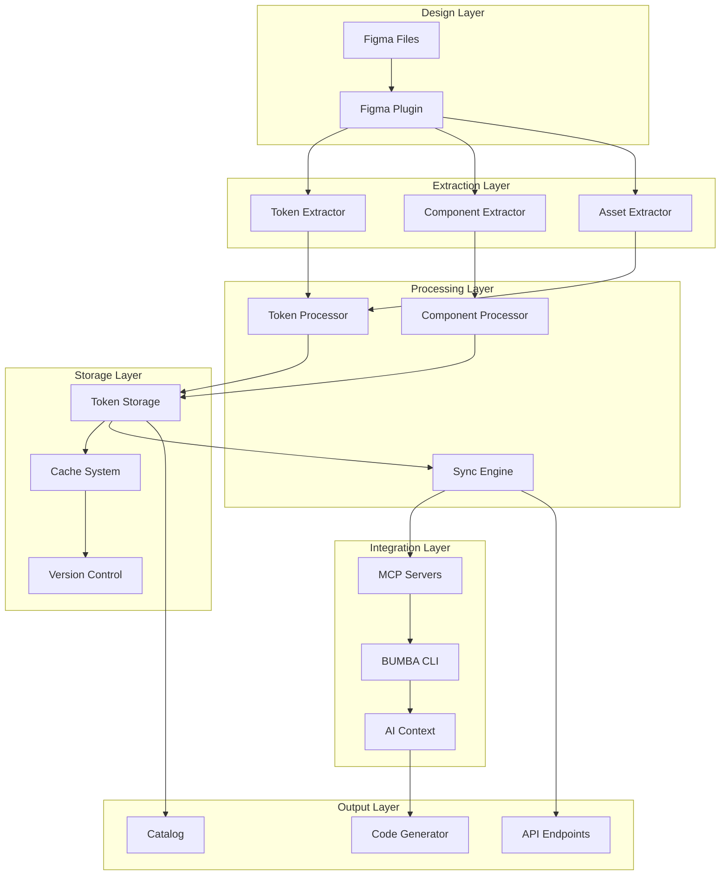

# Design Bridge Technical Architecture

## System Overview

### Core Components



## Data Flow Patterns

### 1. Token Extraction Flow
```
Figma Styles → Plugin Detection → Extraction → Transformation → Storage → Sync
```

### 2. Component Analysis Flow
```
Component Tree → Property Mapping → Variant Analysis → Schema Generation → Code Template
```

### 3. Change Propagation Flow
```
Design Change → Webhook/Poll → Diff Analysis → Impact Assessment → Update Strategy → Code Generation → Git Automation
```

## API Interaction Patterns

### Figma API
- **Authentication**: OAuth 2.0 with refresh tokens
- **Rate Limiting**: 3000 requests/minute with exponential backoff
- **Data Format**: JSON with nested node structure
- **Webhook Support**: Version change notifications

### MCP Server Communication
- **Protocol**: JSON-RPC over stdio
- **Message Format**: Standardized MCP protocol
- **Error Handling**: Graceful degradation with fallbacks
- **State Management**: Session persistence

## Error Handling Philosophy

### Levels of Failure
1. **Recoverable**: Retry with backoff
2. **Degradable**: Fallback to cached data
3. **Critical**: User notification with manual intervention
4. **Fatal**: System shutdown with state preservation

### Recovery Strategies
```javascript
class ErrorRecovery {
  strategies = {
    'RATE_LIMIT': async () => this.backoffRetry(),
    'AUTH_FAIL': async () => this.refreshToken(),
    'NETWORK': async () => this.useCachedData(),
    'PARSE': async () => this.fallbackParser(),
    'CONFLICT': async () => this.requestUserInput()
  }
}
```

## State Management

### Global State
```javascript
const DesignBridgeState = {
  figma: {
    connected: boolean,
    lastSync: timestamp,
    fileVersion: string
  },
  tokens: {
    colors: Map,
    typography: Map,
    spacing: Map,
    effects: Map
  },
  components: {
    registry: Map,
    dependencies: Graph,
    variants: Map
  },
  sync: {
    queue: Array,
    inProgress: boolean,
    conflicts: Array
  }
}
```

## Performance Considerations

### Optimization Strategies
1. **Incremental Updates**: Only process changed nodes
2. **Lazy Loading**: Load component details on demand
3. **Parallel Processing**: Extract tokens concurrently
4. **Smart Caching**: Invalidate only affected cache entries
5. **Batch Operations**: Group API calls for efficiency

### Benchmarks
- Token extraction: < 2s for 100 tokens
- Component analysis: < 5s for 50 components
- Full sync: < 30s for complete design system
- Change propagation: < 10s from detection to PR

## Security Architecture

### Authentication
- Figma tokens encrypted at rest
- Token rotation every 30 days
- Scoped permissions per operation
- Audit logging for all changes

### Data Protection
- Local encryption for sensitive data
- Secure communication channels
- No credential storage in code
- Environment variable isolation

## Scalability Design

### Horizontal Scaling
- Stateless extraction workers
- Queue-based job distribution
- Distributed caching layer
- Load-balanced API endpoints

### Vertical Scaling
- Memory-efficient data structures
- Streaming for large files
- Progressive rendering in catalog
- Incremental compilation

## Integration Points

### BUMBA CLI
```javascript
// Integration interface
class DesignBridgeInterface {
  async initialize(config)
  async extractTokens(fileId)
  async syncChanges()
  async generateCatalog()
  async injectContext(prompt)
}
```

### MCP Servers
- Memory: Store design tokens
- Filesystem: Save extracted data
- Sequential-thinking: Analyze changes
- GitHub: Automate PRs

## Decision Log

### Key Decisions Made
1. **TypeScript for Plugin**: Type safety with Figma API
2. **Event-driven Architecture**: Flexibility and extensibility
3. **JSON Token Format**: Industry standard compatibility
4. **Git-based Versioning**: Developer familiarity
5. **Static Catalog Generation**: Performance and portability

### Trade-offs Accepted
1. **Complexity vs Features**: Chose comprehensive over simple
2. **Speed vs Accuracy**: Prioritized accuracy
3. **Automation vs Control**: Balanced with approval mechanisms
4. **Storage vs Compute**: Cached aggressively for speed

---

*Architecture Version: 1.0.0*
*Last Updated: Sprint A.2*